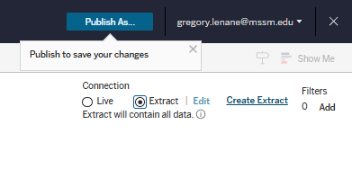

# Publishing a Tableau Dataset

[Back to Table of Contents](../../README.md#table-of-contents)

## Check Connection Type

Before publishing, make sure you have selected the desired connection type. Please review [Extract vs. Live Connection](Admin%20Guide/Tableau/Extract%20vs.%20Live%20Connection.md) for best practices on what selection to make.

1. If you have chosen to use a live connection, make sure the `Live` bubble has been selected in the top right corner.

2. If you have chosen to use an extract conncetion, select the `Extract` bubble and select Create Extract. The extract can take several minutes to load.

3. Now you must select the `Publish As...` button in the top right. Make sure you are publishing the datasource to the correct project folder. Make sure you check the embed credentials box (this will ensure that team members do not have to submit the connection credentials every time they use the datasource). Our standard naming convention applies here as well, and it is best practice to name the datasource exactly how the table/file is named to avoid confusion. Finally, select publish. Refreshing the project folder should show the datasource now.

4. For Extract connections, you will most likely want to select a refresh cadence. Select the 3 elipses and select `Refresh Extracts Now...` if you would like to manually refresh the datasource. If you want to create a refresh cadence then select `Refresh Extracts...`. Select the desired refresh cadence from the list of options and select `Schedule Refresh`.

