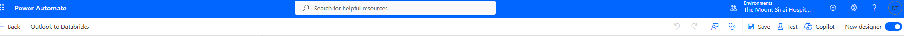

# Common Definitions

[Back to Table of Contents](README.md#table-of-contents)

## Databricks Terms

- **All-purpose compute**: Interactive compute used for notebook development and ad hoc analysis.
- **Catalog**: The top-level Databricks container used to organize governed data.
- **Compute**: The Databricks environment that runs SQL, notebooks, and jobs. Teams choose shared, serverless, or job-specific compute based on the workload.
- **Git Folder**: A Databricks workspace folder connected to a Git repository.
- **Job**: A scheduled or manually triggered Databricks workflow that runs a task such as a notebook or query.
- **Notebook**: A Databricks document used to write and run code, SQL, notes, and analysis steps.
- **Personal access token**: A secret token used to authenticate a user or tool to a system such as Databricks. Do not commit tokens to GitHub.
- **Schema**: A container inside a catalog that groups related tables and volumes.
- **Service principal**: An automation identity used by jobs, workflows, or integrations instead of an individual user account.
- **SQL warehouse**: Compute used for SQL queries, dashboards, and reporting in the SQL editor.
- **Table**: A queryable dataset stored inside a schema.
- **Volume**: A governed file storage location inside a schema, often used for uploaded or staged files before they become tables.
- **Webhook**: A configured URL that lets one system send an event or alert to another system, such as Databricks sending job notifications to Teams.
- **Workspace**: The Databricks environment where users write notebooks, run jobs, manage compute, and access governed data.

## dbt Terms

- **dbt**: The SQL transformation framework our team uses after source data has landed in the Catalog.
- **dbt build**: A dbt command that runs models, tests, snapshots, and seeds for the selected project.
- **dbt model**: A SQL file in a dbt project that builds a view or table.
- **dbt source**: A named reference in dbt to an existing upstream table outside the dbt model flow.
- **GitHub workflow**: An automated GitHub Actions process that runs when configured repository events occur, such as pushes to `staging` or `main`.
- **Materialization**: The way dbt stores a model result, such as a view or table.
- **ref**: A dbt function used to reference another dbt model and manage build order.
- **source**: A dbt function used to reference an upstream source table defined in `schema.yml`.

## Tableau Terms

- **Datasource**: A reusable Tableau connection layer that defines where data comes from, how Tableau should query it, and the fields, calculations, and metadata available to workbooks.
- **Extract**: A Tableau-managed snapshot of data that is refreshed on a schedule and queried by Tableau instead of continuously querying the source system.
- **Live connection**: A Tableau connection type that queries the source system directly when users open or interact with a workbook.

## Power Automate

**Power Automate** (formerly Microsoft Flow) is a Microsoft cloud automation platform included in Microsoft 365. It lets you build workflows — called **flows** — that connect services together without writing a backend server.

In the context of this guide, Power Automate acts as the bridge between Microsoft data sources (SharePoint, Outlook, OneDrive) and Databricks. It watches for an event, fetches file content, and calls the Databricks REST API to upload files to a Volume and trigger a Job.

### Flow Structure

Every flow has three parts:

- **Trigger** — the event that starts the flow (a file is uploaded, an email arrives, a schedule fires)
- **Actions** — steps that execute in order after the trigger
- **Outputs** — data passed between steps via dynamic content

### Creating a Flow

1. Go to [make.powerautomate.com](https://make.powerautomate.com)
2. Click **Create → Automated cloud flow**
3. Search for your trigger (e.g., "SharePoint — When a file is created")
4. Add actions using the **+** button between steps

### HTTP Methods

HTTP verbs tell the server what operation to perform. Power Automate HTTP actions require you to pick the correct verb:

| Verb | Operation | Databricks Example |
|---|---|---|
| `GET` | Read / retrieve a resource | List jobs, check run status, download a file |
| `POST` | Create a new resource or trigger an action | Trigger a job run, create a cluster |
| `PUT` | Replace a resource at a specific path | Upload a file to a Volume (replaces if exists) |
| `PATCH` | Partially update an existing resource | Update a job's schedule |
| `DELETE` | Remove a resource | Delete a file from a Volume |

### Dynamic Content and Expressions

Power Automate passes data between steps using **dynamic content** (point-and-click) or **expressions** (typed in the `fx` bar).

Dynamic content inserts values from previous steps:
- `triggerOutputs()?['body/{FilenameWithExtension}']` — filename from a SharePoint trigger

Expressions transform values:
- `base64ToBinary(body('Get_file_content_using_path')?['$content'])` — decodes base64-encoded file content back to raw binary

Always enter expressions via the **fx** button in the action panel. Typing them as plain text sends the literal string instead of evaluating it.

## Testing a Flow

Use **Test** (top right of the flow editor) to run the flow manually and inspect each step's inputs and outputs. If an action fails, expand it to see the raw HTTP response — the `message` field usually explains exactly what went wrong.

## Common Errors

| Error | Likely cause |
|---|---|
| `403 Forbidden — required scopes: files` | PAT missing the `files` scope |
| `403 Forbidden — required scopes: jobs` | PAT missing the `jobs` scope |
| File arrives as 0 bytes | Body expression not evaluated via `fx` — sending JSON envelope instead of binary |
| `InvalidJson` on POST | Body is not valid JSON, or Content-Type is wrong |
