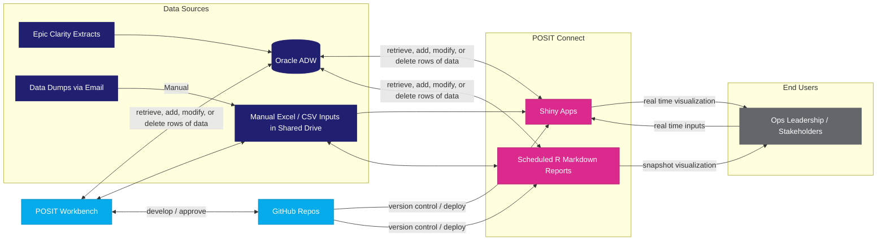

## Oracle/Posit - Current State

```mermaid
flowchart LR
    subgraph Sources["Data Sources"]
        EPIC[Epic Clarity Extracts]
        ORA[(Oracle ADW)]
        EMAIL[Data Dumps via Email]
        XLS[Manual Excel / CSV Inputs in Shared Drive]
    end

    subgraph Deploy["POSIT Connect"]
        SHINY[Shiny Apps]
        RPT[Scheduled R Markdown Reports]
    end

    GH[GitHub Repos]
    RS[POSIT Workbench]

    subgraph Users["End Users"]
        USR[Ops Leadership / Stakeholders]
    end

    EPIC --> ORA
    ORA <-->|retrieve, add, modify, or delete rows of data| SHINY
    ORA <-->|retrieve, add, modify, or delete rows of data| RPT
    EMAIL -->|Manual| XLS
    XLS --> SHINY
    XLS <--> RPT
    GH -->|version control / deploy| SHINY
    GH -->|version control / deploy| RPT
    SHINY -->|real time visualization| USR
    RPT -->|snapshot visualization| USR
    USR -->|real time inputs| SHINY
    RS <-->|develop / approve|GH
    RS <-->|retrieve, add, modify, or delete rows of data| ORA
    RS <--> XLS
    

    classDef navy fill:#212070,stroke:#212070,color:#ffffff
    classDef cyan fill:#06ABEB,stroke:#0689BC,color:#ffffff
    classDef magenta fill:#DC298D,stroke:#B02171,color:#ffffff
    classDef gray fill:#63666A,stroke:#63666A,color:#ffffff

    class EPIC,ORA,EMAIL,XLS navy
    class GH,RS cyan
    class SHINY,RPT magenta
    class USR gray
```

## Databricks/Tableau - Future State
