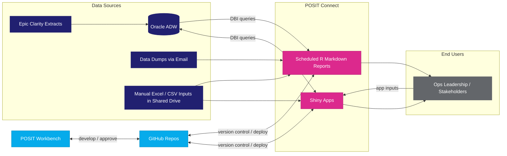

## Databricks

### Current State

```mermaid
flowchart LR
    subgraph Sources["Data Sources"]
        EPIC[Epic Clarity Extracts]
        ORA[(Oracle ADW)]
        EMAIL[Data Dumps via Email]
        XLS[Manual Excel / CSV Inputs in Shared Drive]
    end

    subgraph Deploy["POSIT Connect"]
        SHINY[Shiny Apps]
        RPT[Scheduled R Markdown Reports]
    end

    GH[GitHub Repos]
    RS[POSIT Workbench]

    subgraph Users["End Users"]
        USR[Ops Leadership / Stakeholders]
    end

    EPIC --> ORA
    ORA <-->|DBI queries| SHINY
    ORA -->|DBI queries| RPT
    EMAIL --> RPT
    XLS --> SHINY
    XLS --> RPT
    GH <-->|version control / deploy| SHINY
    GH <-->|version control / deploy| RPT
    SHINY --> USR
    RPT --> USR
    USR -->|app inputs| SHINY
    RS <--> |develop / approve|GH
    

    classDef navy fill:#212070,stroke:#212070,color:#ffffff
    classDef cyan fill:#06ABEB,stroke:#0689BC,color:#ffffff
    classDef magenta fill:#DC298D,stroke:#B02171,color:#ffffff
    classDef gray fill:#63666A,stroke:#63666A,color:#ffffff

    class EPIC,ORA,EMAIL,XLS navy
    class GH,RS cyan
    class SHINY,RPT magenta
    class USR gray
```

### Future State
