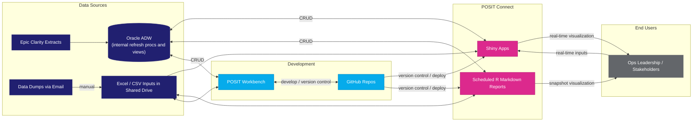

## Oracle/Posit - Current State

Note:
- CRUD : Create, Read, Update and Delete
- internal refresh procs and views : Oracle provided abilities through `Oracle Procedures Module` to create a job and run based on specified cadence to refresh tables 

## Databricks/Tableau - Future State
