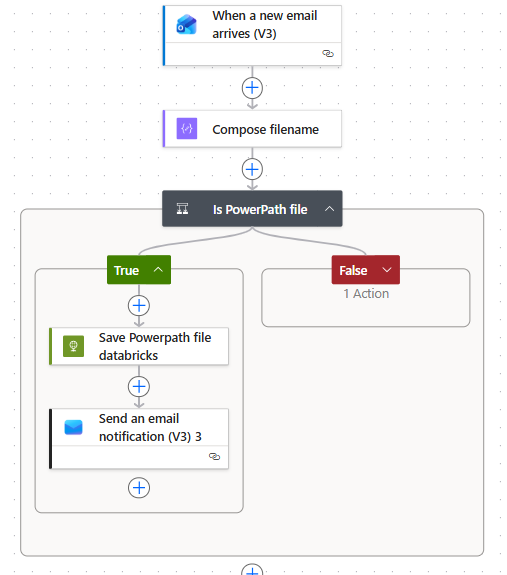
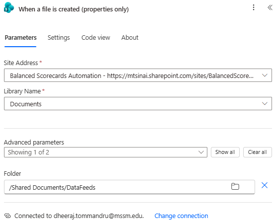
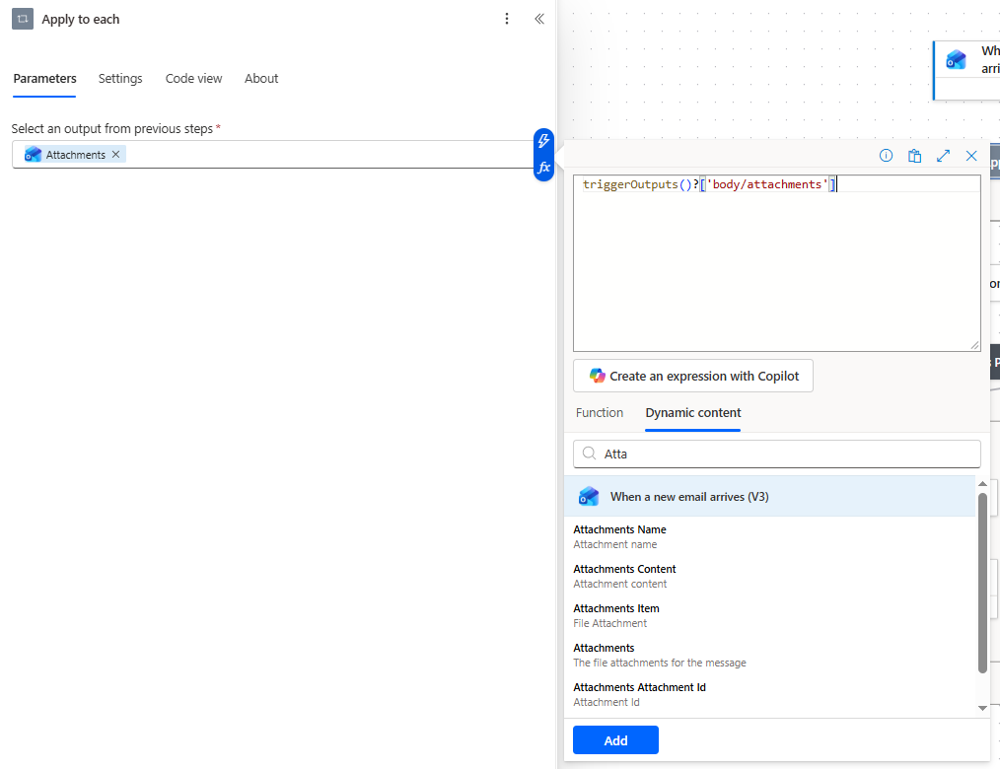
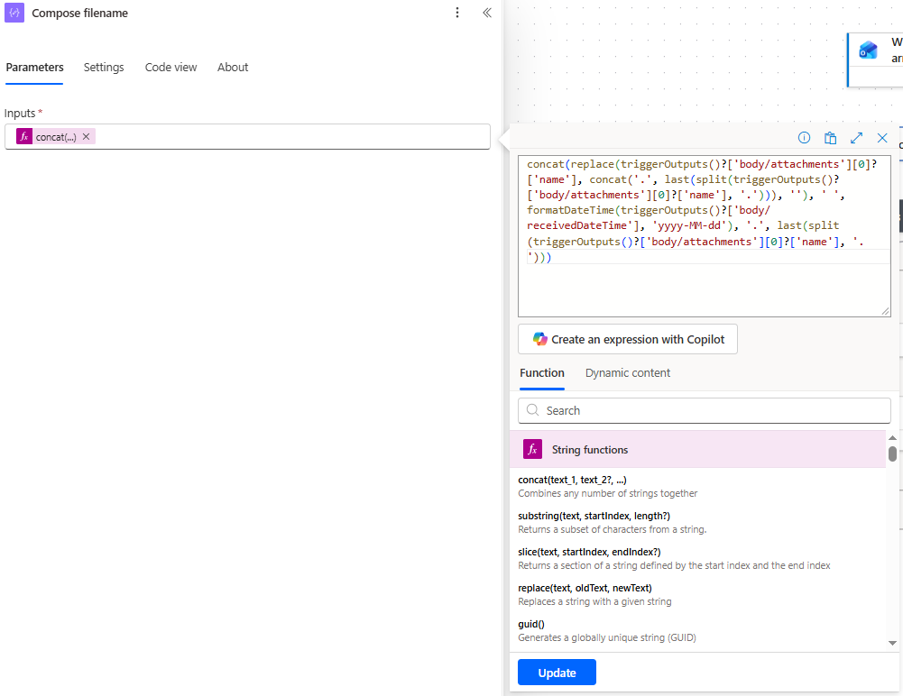

# Power Automate — Outlook to Databricks

This pipeline watches an Outlook mailbox for emails with file attachments and automatically uploads those attachments to a Databricks Catalog [Volume](../../Common%20Definitions.md#volume).



## Architecture
```
Outlook Inbox
        ↓ (email with attachment arrives)
Power Automate Flow
        ↓ (4 actions)
   1. When a new email arrives (V3) — Outlook trigger
   2. compose file name
   3. HTTP PUT → Databricks Files API — uploads to Volume
   4. Send E-mail
        ↓
Databricks Job (notebook)
        ↓
Delta Table in Catalog
```

## Prerequisites

- Microsoft 365 account with an Outlook mailbox and [Power Automate](../../Common%20Definitions.md#power-automate) access
- Databricks workspace with Catalog enabled
- [Personal Access Token](../../Common%20Definitions.md#personal-access-token-pat) with `files` scope
- Target [Volume](../../Common%20Definitions.md#volume) already created in the Catalog

## Power Automate Flow

### Action 1: When a new email arrives (V3)




| Field | Value |
|---|---|
| From | Sender E-mails |
| Include Attachments | **Yes** |
| Only with Attachments | **Yes** |

Optionally filter by subject line using **Show advanced options → Subject filter**:

```
Subject filter: [DATA FEED]
```

This limits the trigger to emails whose subject contains `[DATA FEED]`, reducing noise.

**Note :** 
- Outlook emails can have multiple attachments. Use an **Apply to each** loop:
- **Select an output from previous steps**: `Attachments` (dynamic content from trigger)



### Action 2: Compose

Compose action lets you rename the file. For example if file is sent as `KPI REPORT - RAW DATA V4_V2.xls`, You may use compose action to append date to file name `KPI REPORT - RAW DATA V4_V2 2026-06-04.xls` and send it Databricks. 



Power Automate Expression Shown in image above:
```
concat(replace(triggerOutputs()?['body/attachments'][0]?['name'], concat('.', last(split(triggerOutputs()?['body/attachments'][0]?['name'], '.'))), ''), ' ', formatDateTime(triggerOutputs()?['body/receivedDateTime'], 'yyyy-MM-dd'), '.', last(split(triggerOutputs()?['body/attachments'][0]?['name'], '.')))
```

### Action 3: HTTP PUT — Upload to Volume

| Field | Value |
|---|---|
| Method | `PUT` |
| URI | `https://<workspace>.azuredatabricks.net/api/2.0/fs/files/Volumes/<catalog>/<schema>/<volume>/outputs('Compose_filename')/?overwrite=true` |
| Header: Authorization | `Bearer <PAT>` |
| Header: Content-Type | `application/octet-stream` |
| Body (expression) | `base64ToBinary(items('Apply_to_each')?['ContentBytes'])` |

The `ContentBytes` field on an Outlook attachment is already base64-encoded. The expression decodes it to raw binary before sending to the Databricks Files API. 

`?overwrite-true` in URI tells Databricks to overwrite the if there's a file with same name

Enter the expression via the **fx** button — not as plain text.


## Common Errors

| Error | Cause | Fix |
|---|---|---|
| `403 Forbidden — required scopes: files` | PAT missing `files` scope | Regenerate PAT with `files` scope |
| File arrives as 0 bytes | `ContentBytes` not decoded via `base64ToBinary` | Enter expression via fx button |
| Loop processes 0 attachments | `Include Attachments` not set to Yes on trigger | Edit trigger settings |
| `IsADirectoryError` in notebook | `file_name` parameter is empty | Ensure `Name` dynamic content resolves correctly |
