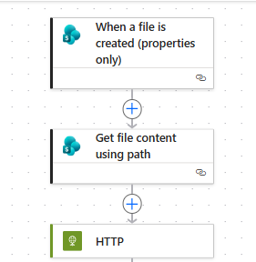
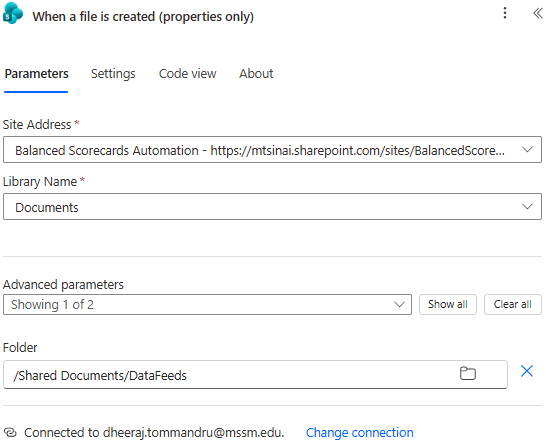

# Power Automate — SharePoint to Databricks

End-to-end event-driven pipeline that uploads SharePoint files to a Databricks Catalog Volume.



## Architecture

```
SharePoint Document Library
        ↓ (file uploaded)
Power Automate Flow
        ↓ (4 actions)
   1. When a file is created (properties only) — SharePoint trigger
   2. Get file content using path — fetches file bytes
   3. HTTP PUT → Databricks Files API — uploads to Volume
        ↓
Databricks Job (notebook)
        ↓ (reads Excel, transforms)
Delta Table in Catalog
```

## Prerequisites

- Microsoft 365 account with [Power Automate](../../Common%20Definitions.md#power-automate) access
- Databricks workspace with Catalog enabled
- Workspace admin must enable the `files` API scope for PATs
- [Personal Access Token](../../Common%20Definitions.md#personal-access-token-pat) with `files` scope
- Permissions on the target Volume (`WRITE VOLUME`) and Schema (`CREATE TABLE`)

## Setup

### 1. SharePoint

- Site: Balanced Scorecards Automation
- Library: Documents
- Watched folder: `/Shared Documents/DataFeeds`

### 2. Databricks Volume

```
/Volumes/datahub_dev_bronze/scorecards_raw_files/finance/
```

### 3. Personal Access Token

Databricks workspace → **Settings → Developer → Access Tokens → Generate new token**

Required scopes:
- `files` — to upload to Volumes via REST API

Without these scopes, requests return `403 Forbidden: required scopes: <scope>`.

## Power Automate Flow

### Action 1: When a file is created (properties only)




| Field | Value |
|---|---|
| Site Address | Balanced Scorecards Automation |
| Library Name | Documents |
| Folder | `/Shared Documents/DataFeeds` |

Avoid the deprecated `When a file is created in a folder` trigger.

### Action 2: Get file content using path

| Field | Value |
|---|---|
| Site Address | (same as above) |
| File Path | `Full path` (dynamic content from trigger) |
| Infer Content Type | **No** |

Setting **Infer Content Type** to **No** is critical for binary files like Excel. When set to `Yes`, Power Automate tries to interpret the file and corrupts the binary content, resulting in a 0-byte file landing in the Volume.

### Action 3: HTTP PUT — Upload to Volume

| Field | Value |
|---|---|
| Method | `PUT` |
| URI | `https://adb-7405606624435497.17.azuredatabricks.net/api/2.0/fs/files/Volumes/datahub_dev_bronze/scorecards_raw_files/finance/@{triggerOutputs()?['body/{FilenameWithExtension}']}` |
| Header: Authorization | `Bearer <PAT>` |
| Header: Content-Type | `application/octet-stream` |
| Body (expression) | `base64ToBinary(body('Get_file_content_using_path')?['$content'])` |

The Body expression is essential. SharePoint hands Power Automate a JSON envelope:

```json
{
  "$content-type": "application/octet-stream",
  "$content": "UEsDBBQABg..."
}
```

The expression extracts the `$content` field and decodes the base64 string back into raw binary, which is what the Databricks Files API expects.

Enter this through the **fx (function)** button — not as plain text — otherwise Power Automate sends the literal string instead of evaluating it.


## Common Errors

### `403 Forbidden — required scopes: files`
PAT missing the `files` scope. Workspace admin must enable scoped tokens, then regenerate the PAT with the `files` scope added.

### `403 Forbidden — required scopes: jobs`
Same issue but for the `jobs` scope. Regenerate PAT with both scopes.

### File lands in Volume but shows 0.00 B
The HTTP Body is sending the JSON envelope instead of the decoded file content. Verify the Body expression is `base64ToBinary(body('Get_file_content_using_path')?['$content'])` entered via **fx** (not plain text).

### `NotFound` on Get file content step
Using `Get file content` (by ID) with the `When a file is created (properties only)` trigger fails because the trigger outputs a list item ID, not a file ID. Use `Get file content using path` and pass the `Full path` dynamic value instead.
