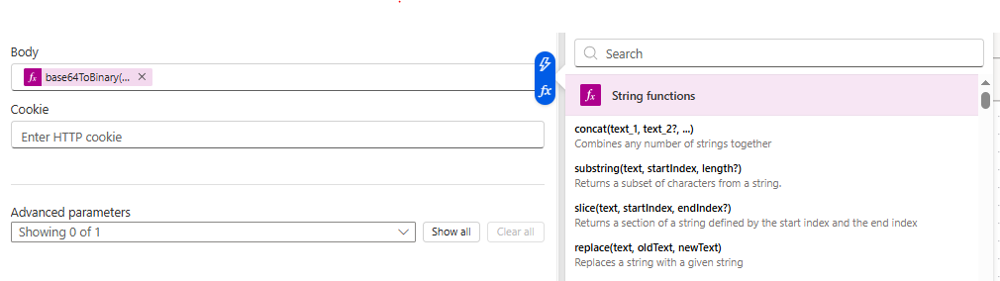

# What is Power Automate?

**Power Automate** (formerly Microsoft Flow) is a Microsoft cloud automation platform included in Microsoft 365. It lets you build workflows — called **flows** — that connect services together without writing a backend server.

In the context of this guide, Power Automate acts as the bridge between Microsoft data sources (SharePoint, Outlook, OneDrive) and Databricks. It watches for an event, fetches file content, and calls the Databricks REST API to upload files to a [Volume](../Common%20Definitions.md#volume) and trigger a [Job](../Common%20Definitions.md#job).

## Flow Structure

Every flow has three parts:

1. **Trigger** — the event that starts the flow (a file is uploaded, an email arrives, a schedule fires)
2. **Actions** — steps that execute in order after the trigger
3. **Outputs** — data passed between steps via dynamic content

## Creating a Flow

1. Go to [make.powerautomate.com](https://make.powerautomate.com)
2. Click **Create → Automated cloud flow**
3. Search for your trigger (e.g., "SharePoint — When a file is created")
4. Add actions using the **+** button between steps

## HTTP Methods

HTTP verbs tell the server what operation to perform. Power Automate HTTP actions require you to pick the correct verb:

| Verb | Operation | Databricks Example |
|---|---|---|
| `GET` | Read / retrieve a resource | List jobs, check run status, download a file |
| `POST` | Create a new resource or trigger an action | Trigger a job run, create a cluster |
| `PUT` | Replace a resource at a specific path | Upload a file to a Volume (replaces if exists) |
| `PATCH` | Partially update an existing resource | Update a job's schedule |
| `DELETE` | Remove a resource | Delete a file from a Volume |

## Dynamic Content and Expressions

Power Automate passes data between steps using **dynamic content** (point-and-click) or **expressions** (typed in the `fx` bar).

Dynamic content inserts values from previous steps:
- `triggerOutputs()?['body/{FilenameWithExtension}']` — filename from a SharePoint trigger

Expressions transform values:
- `base64ToBinary(body('Get_file_content_using_path')?['$content'])` — decodes base64-encoded file content back to raw binary

Always enter expressions via the **fx** button in the action panel. Typing them as plain text sends the literal string instead of evaluating it.

## Testing a Flow

Use **Test** (top right of the flow editor) to run the flow manually and inspect each step's inputs and outputs. If an action fails, expand it to see the raw HTTP response — the `message` field usually explains exactly what went wrong.

## Common Errors

| Error | Likely cause |
|---|---|
| `403 Forbidden — required scopes: files` | PAT missing the `files` scope |
| `403 Forbidden — required scopes: jobs` | PAT missing the `jobs` scope |
| File arrives as 0 bytes | Body expression not evaluated via `fx` — sending JSON envelope instead of binary |
| `InvalidJson` on POST | Body is not valid JSON, or Content-Type is wrong |
